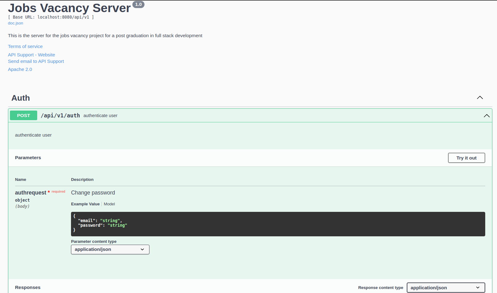

# TCC-jobs-vacancy-BE


# JobsVacancy Server

Backend para o trabalho de conclusao de curso de pos graduacao desenvolvimento full stack. O objetivo desse desenvolvimento eh construir uma aplicacao para a divulgacao de vagas de emprego.

**Índice**
- [Princípios](#principios)
- [Documentaçao](#documentacao)
- [Requisitos](#requisitos)
- [Executando](#executando)

## Principios
Os principios seguidos no desenvolvimento desta aplicacao incluem:
- **Independencia**: para cada responsabilidade dentro do sistema eh devidamente separado.
- **Escalabilidade**: a arquitetura foi pensada para que possa suportar o crescimento rapido e manter facilidade na manutecao.
- **Seguranca**: foram utilizados praticas de seguranca para garantir a seguranca das funcionalidades da aplicacao.

## Documentaçao

Para documentar as APIs criadas para o servidor, foi utilizado a biblioteca *swaggo* para gerar a documentacao para o formato swagger.

A documentacao eh gerada a partir da escrita de comentarios sobre os metodos responsaveis pelas APIs.

```// Auth godoc
// @Summary authenticate user
// @Description authenticate user
// @Tags Auth
// @Param authrequest body AuthRequest true "Change password"
// @Success 200 {object} AuthResponse "Success"
// @Failure 400 "Bad request"
// @Failure 500 "Internal server error"
// @Router /api/v1/auth [post]
func Auth(w http.ResponseWriter, r *http.Request) {
	var authRequest AuthRequest
	err := json.NewDecoder(r.Body).Decode(&authRequest)
	if err != nil {
		http.Error(w, "bad body format", http.StatusBadRequest)
		return
	}

	authDomain := authfactory.CreateAuthDomain()

	token, roleId, err := authDomain.UserAuth(authRequest.Email, authRequest.Password)
	if err != nil {
		http.Error(w, err.Error(), http.StatusUnauthorized)
		return
	}

	authResponse := AuthResponse{
		Token:  token,
		RoleId: roleId,
	}

	w.Header().Set("Content-Type", "application/json")
	json.NewEncoder(w).Encode(&authResponse)
}
```

Com isso podemos gerar a documentacao com o comando:
```shell
swag init --output ./docs --dir ./src/ --pd
```

Quando o servidor estiver rodando, ao acessarmos o endereco: 
```
/swagger/index.html#/Auth/post_api_v1_auth
```

<p align="center">
  
</p>


## Requisitos

- **[Golang](https://go.dev/)**
- **[Docker](https://docs.docker.com/engine/install/)**
- **[Docker Compose](https://docs.docker.com/compose/)**
- **[PostgreSQL](https://www.postgresql.org/)**

Caso seja executado no ambiente local, as dependencias do projeto desenvolvido em golang, sao automaticamente baixadas e instaladas com o comando:
```shell
go mod download && go mod verify
```

## Executando

Para executar o server localmente:
1. Clonar o repositorio
```shell
git clone https://github.com/rafixcs/TCC-jobs-vacancy-BE.git
```

3. Criar os arquivos de ambiente
- server.env
```env
TOKEN_SECRET="testecaralhow"
DB_HOST="db"
DB_USER="<usuario bd default: root>"
DB_PASSWORD="<senha db default: root>"
DB_NAME="<noma da db default: jobsfinder>"
DB_PORT="<porta da bd default: 5432>"
EXPORTS_PATH="<diretorio de exportacao default: /app/exports>"
ENV_APP="<ENV ou PRD>"
PORT="<port>"

R2_ENDPOINT="<endpoint>"
BUCKET_NAME="<nome do bucket>"
CF_ACCESS_KEY="<chave de acesso>"
CF_SECRET_ACCESS_KEY="<chave de acesso secreto>"
```

- db.env
```env
POSTGRES_USER="<usuario db default: root>"
POSTGRES_PASSWORD="<senha db default: root>"
POSTGRES_DB="<nome db default: jobsfinder>"
```

2. Subir o docker com docker compose
```shell
docker compose up --build
```
A partir dai teremos o container para o servidor rodando e outro container com a base de dados postgresql.
